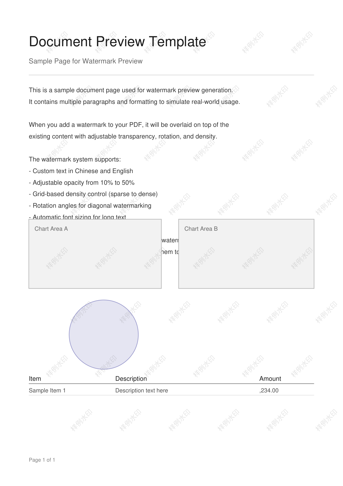
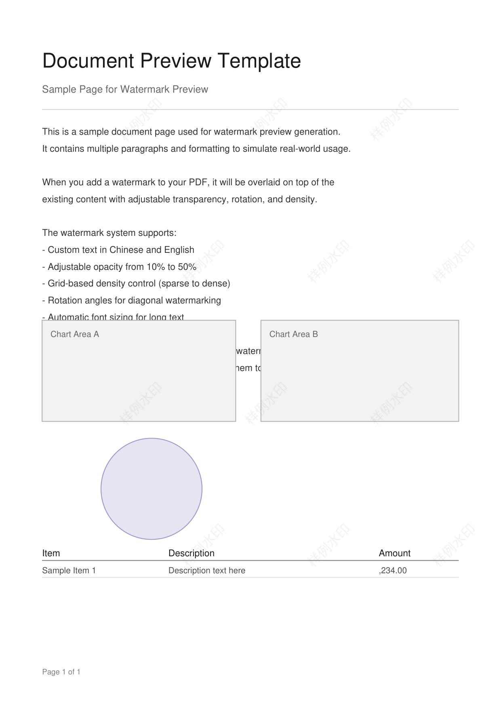
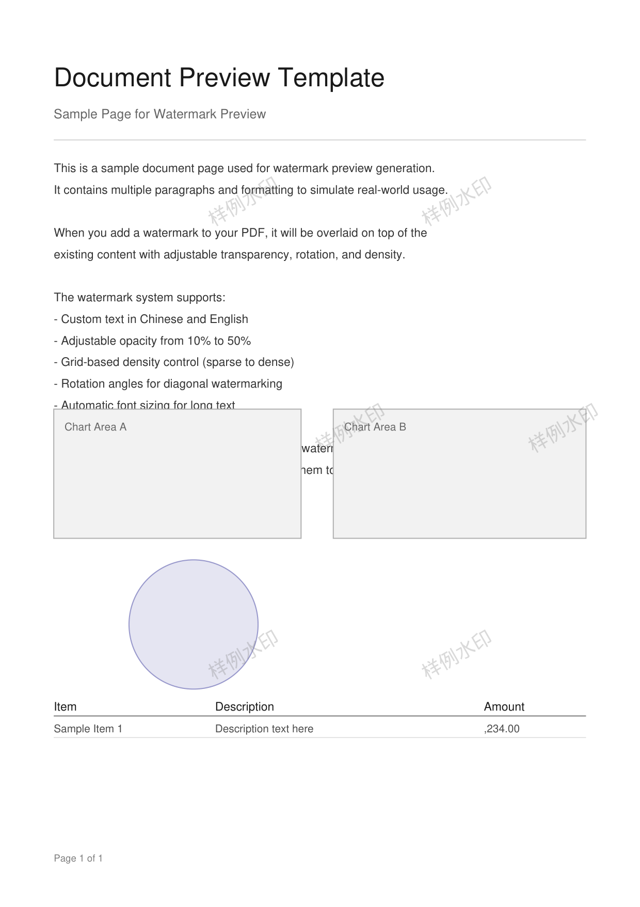

# PDF Watermark

Add text watermarks to PDF documents with visual preset selection and custom parameter control.

## Features

- **Visual Preset Selection** — Preview 4 watermark styles before applying
- **Custom Parameters** — Full control over font, opacity, density, rotation
- **Chinese & English Support** — Built-in CJK fonts (Source Han Serif)
- **Dense Grid Layout** — Staggered watermark grid for maximum coverage
- **Vector Text** — Minimal PDF size increase, sharp at any zoom level

## Presets

| Preset | Font | Opacity | Grid | Best For |
|:---|:---|:---|:---|:---|
| **⭐ Dense Protection** | 12pt | 20% | 6×8 | Confidential files, anti-leak |
| Light & Sparse | 16pt | 10% | 3×4 | Formal contracts |
| Balanced Standard | 14pt | 15% | 4×6 | General office docs |
| Bold Notice | 18pt | 30% | 2×3 | Drafts, internal circulation |

## Quick Start

### Check Environment

```bash
python3 check_env.py
```

### Install Dependencies

```bash
python3 -m pip install pymupdf
```

If installation fails, install system dependencies first:
- **macOS**: `brew install mupdf swig freetype`
- **Ubuntu**: `sudo apt install libfreetype6-dev`
- **Windows**: Install [VC++ Redistributable](https://learn.microsoft.com/cpp/windows/latest-supported-vc-redist)

### Add Watermark (Preset)

```bash
python3 watermark.py -i input.pdf -o output.pdf -t "机密文件" --preset dense
```

### Add Watermark (Custom)

```bash
python3 watermark.py -i input.pdf -o output.pdf -t "Draft" \
  --font-size 10 --opacity 0.15 --cols 8 --rows 10 --rotation 45
```

### Generate Preview Only

```bash
python3 watermark.py -i input.pdf -t "Preview" --preset dense --preview preview.png
```

## CLI Reference

```
python3 watermark.py -i INPUT -o OUTPUT -t TEXT [options]

Required:
  -i, --input       Input PDF file
  -o, --output      Output PDF file
  -t, --text        Watermark text

Optional:
  -p, --preset      Preset: dense | light | standard | bold
  --font-size       Font size in points (default: 12)
  --opacity         Opacity 0.0-1.0 (default: 0.20)
  --cols            Grid columns (default: 6)
  --rows            Grid rows (default: 8)
  --rotation        Rotation angle in degrees (default: 45)
  --color           Text color: gray | black | blue | red
  --no-stagger      Disable staggered layout
  --preview PNG     Preview mode: generate PNG of first page only
  --check           Check PyMuPDF installation
```

## Screenshots

### Dense Protection (Recommended)


### Light & Sparse


### Balanced Standard


### Bold Notice


## File Structure

```
pdf-watermark/
├── watermark.py          # Core watermark engine
├── check_env.py          # Environment checker
├── SKILL.md              # Skill documentation
├── README.md             # This file
└── assets/
    ├── demo_page.pdf     # Preview template
    └── sample_*.png      # Preset visual references
```

## Requirements

- Python >= 3.8
- PyMuPDF >= 1.23.0

## License

MIT
